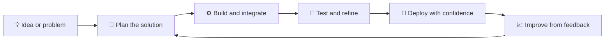

<h1 align="center">Hey, I'm Hamid Javed 👋</h1>

  <strong>Software Engineer · MERN Stack · DevOps · AWS · AI-Powered Apps</strong>

  <a href="https://hamidstack.com/">🌐 Portfolio</a> ·
  <a href="https://www.upwork.com/freelancers/~014bb6255b56b54124">💼 Upwork</a> ·
  <a href="https://www.fiverr.com/hamidjaved_">🛠️ Fiverr</a> ·
  <a href="mailto:hamidjaved615@gmail.com">✉️ Email</a>

  
  

  

## 👨‍💻 About me

I build practical, production-minded software for startups and businesses—from first MVPs to full SaaS platforms, admin dashboards, REST APIs, e-commerce sites, and web portals.

I also help teams improve existing applications by debugging difficult issues, modernizing codebases, and making deployments more reliable with AWS, Docker, and CI/CD.

<strong>✨ What I can help with</strong>

- Full-stack web applications
- React and Next.js frontends
- Node.js, Express, Django, and Python backends
- REST APIs and database design
- AWS deployments and cloud infrastructure
- Docker and CI/CD pipelines
- Application debugging and performance improvements
- AI-assisted product features and development workflows

## 🧭 How I work

## 🛠️ Tech stack

<strong>Frontend</strong>

<strong>Backend and data</strong>

<strong>Cloud, DevOps, and tools</strong>

I regularly use AI tools such as Claude, Cursor, Antigravity, and Codex as part of my development workflow.

## 📊 GitHub activity

  
  

  

## 🤝 Available for freelance work

I'm available for complete projects, focused feature work, and debugging or improving existing applications.

| Need | Best way to reach me |
| --- | --- |
| Full-stack project or feature | [Upwork](https://www.upwork.com/freelancers/~014bb6255b56b54124) |
| Quick freelance engagement | [Fiverr](https://www.fiverr.com/hamidjaved_) |
| Direct discussion | [hamidjaved615@gmail.com](mailto:hamidjaved615@gmail.com) |
| More about my work | [hamidstack.com](https://hamidstack.com/) |

  <strong>Have an idea or a difficult bug? Let's build something useful.</strong>

