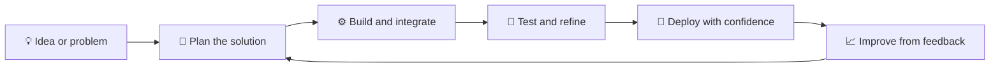

<p align="center">
  <a href="https://hamidstack.com/">
    
  </a>
</p>

<p align="center">
  <a href="https://hamidstack.com/"></a>
  <a href="https://www.upwork.com/freelancers/~014bb6255b56b54124"></a>
  <a href="https://www.fiverr.com/hamidjaved_"></a>
  <a href="mailto:hamidjaved615@gmail.com"></a>
</p>

<p align="center">
  
  
  
</p>

<p align="center">
  
</p>

## 👨‍💻 About me

I build practical, production-minded software for startups and businesses: MVPs, SaaS platforms, admin dashboards, REST APIs, e-commerce sites and desktop apps.

I also help teams rescue and modernize existing codebases, and make deployments boring (in a good way) with AWS, Docker and CI/CD.

```js
const hamid = {
  role: "Software Engineer",
  focus: ["Full-stack web", "Cloud & DevOps", "AI-assisted products"],
  currentlyBuilding: "Local-first desktop POS in Rust",
  workflow: ["Claude", "Cursor", "Codex", "Antigravity"],
  openTo: ["Freelance projects", "Feature work", "Debugging & performance"],
  reachMe: "hamidstack.com",
};
```

## 🚀 Featured projects

<table>
  <tr>
    <td width="50%">
      <a href="https://github.com/Hamid-javed/pos"></a>
    </td>
    <td width="50%">
      <a href="https://github.com/Hamid-javed/az-logics"></a>
    </td>
  </tr>
  <tr>
    <td width="50%">
      <a href="https://github.com/Hamid-javed/virtue-leader-board"></a>
    </td>
    <td width="50%">
      <a href="https://github.com/Hamid-javed/NeuroDriveNext"></a>
    </td>
  </tr>
  <tr>
    <td width="50%">
      <a href="https://github.com/Hamid-javed/resume-generator"></a>
    </td>
    <td width="50%">
      <a href="https://github.com/Hamid-javed/FYP"></a>
    </td>
  </tr>
</table>

## 🧭 How I work



## 🛠️ Tech stack

<p align="center">
  
</p>
<p align="center">
  
</p>

<details>
<summary><strong>✨ What I can help with</strong></summary>

- Full-stack web applications (React, Next.js, Node.js, Django)
- REST APIs and database design
- AWS deployments, Docker and CI/CD pipelines
- Debugging, modernizing and speeding up existing apps
- AI-assisted product features and workflows
- Local-first desktop apps

</details>

## 📊 GitHub stats

<p align="center">
  
  
</p>

<p align="center">
  
</p>

<p align="center">
  <a href="https://github.com/Hamid-javed">
    
  </a>
</p>

## 🤝 Let's work together

I'm available for complete projects, focused feature work, and debugging or improving existing applications.

| Need | Best way to reach me |
| --- | --- |
| Full-stack project or feature | [Upwork](https://www.upwork.com/freelancers/~014bb6255b56b54124) |
| Quick freelance engagement | [Fiverr](https://www.fiverr.com/hamidjaved_) |
| Direct discussion | [hamidjaved615@gmail.com](mailto:hamidjaved615@gmail.com) |
| More about my work | [hamidstack.com](https://hamidstack.com/) |

<p align="center">
  <strong>Have an idea or a difficult bug? Let's build something useful.</strong>
</p>


